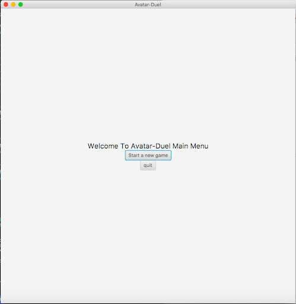
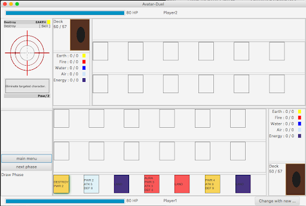

# IF2210 Avatar Duel Group 9

## Code Structure
1. package : written at the beginning of writing codes, which encapsulate a group of classes, sub packages and interfaces, ended with semicolon (;).
2. class : written under package(s), is a blueprint or prototype of object, started and ended with curly brackets 
`public class AvatarDuel {..}`
3.  main : part of the code that'll run.
`public static void main( String[ ] args ) {...}`

## How to Compile and Run
Here is an example of project using gradle as the build tools.
Try running these commands:

`./gradlew run`

You will notice that it will open a window that display 'Avatar Duel'.
In the command line you can see the data that is being read by `CSVReader.java`

What happen is when you use `./gradlew run`, it will start the main function in your app.
For this app, the main function lives in `AvatarDuel.java`.

You can explore more about gradle [here](https://guides.gradle.org/creating-new-gradle-builds/)

## Credit

All images and description are taken from [Avatar Wikia](https://avatar.fandom.com/wiki/Avatar_Wiki)

## Screenshots of Application

